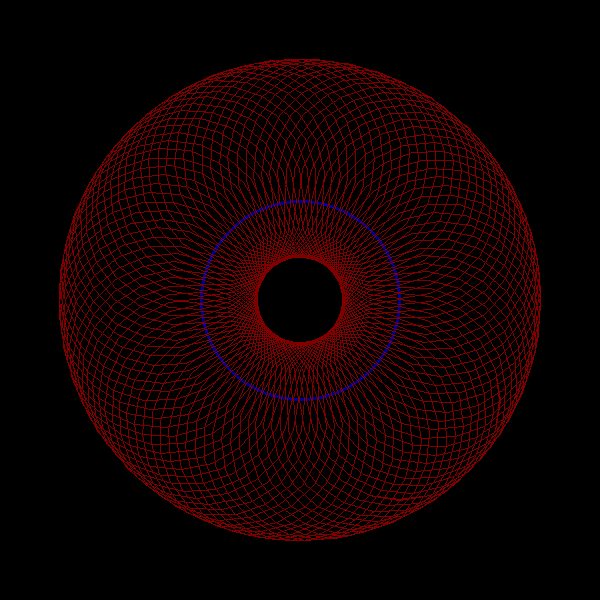

# hyperbolic_laguerre_transformations
A library for visualising the mathematical transformations known as
hyperbolic Laguerre transformations. See
[Wikipedia](https://en.wikipedia.org/wiki/laguerre_transformations) for more.

Like Euclidean Laguerre transformations, hyperbolic Laguerre transformations act on oriented lines in the hyperbolic plane. They don't
act on points.

Hyperbolic Laguerre transformations differ from Euclidean Laguerre transformations in two ways:

-   While the latter use the dual numbers, the former use the double numbers (which are sometimes called the split-complex numbers).
-   While the latter operate on oriented lines in the Euclidean plane, the former operate on oriented lines in the hyperbolic plane.

Examples:

```python
from hyperbolic_laguerre_transformations import *

my_lines = [make_line(t, t + pi/2) for t in linspace(0,2*pi,100)]

transformation = double_matrix(20,0, 0,0, 0,0, 1,0)

animate_transformation(transformation,
                       my_lines,
                       offset=(200,200))
```

This snippet interpolates between the identity matrix and the given
transformation (represented as a double number matrix), applies this sequence
of interpolated transformations to a circle, and then displays the result
as a GIF animation.

The result is:

